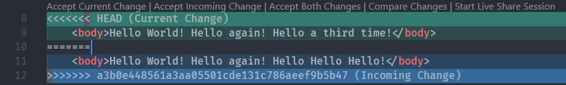

# Git

- To create a git repository
  - create it first on GitHub
  - use ```git clone <url_link>``` to clone the repository into local

- To stage the file into a temporary stage before commiting
  - ```git add <filename>```
  - If alright, nothing will pop up
- To commit
  - ```git commit -m "<message>"```
  - the ```-m``` indicates message
  - insertions indicate number of lines

```bash
[master (root-commit) 5fd2a64] Added hello.html
 1 file changed, 10 insertions(+)
 create mode 100644 hello.html
```

- ```git status```
  - current status of the git repository
  - "Nothing to commit" means that the version is up to date
  
```bash
On branch master
Your branch is based on 'origin/master', but the upstream is gone.
  (use "git branch --unset-upstream" to fixup)

nothing to commit, working tree clean
```

- ```git push``` stores the local repository in a remote server (in this case GitHub)
- ```git pull``` restores the online version of the repository
- Github webpage can edit the code
- Merge Conflicts
  - conflicts occur when local and remote changes are different
  - Git will try to solve that automatically
  - But if same lines are changed, merge conflicts occur
  - In the file, it will look something like the following
  - between ```<<<<``` and ```====``` are the local changes
  - between ```====``` and ```>>>>``` are the remote changes
  - The line of hexdigits are the conflicting commit hash number
  - to solve conflicts, change the lines that are not needed



- ```git log``` show the history of commits
  - each commit is marked by a commit hash
- ```git reset``` reset version
  - ```git reset --hard <commit_hash>``` resets the repository to a specific commit
  - ```git reset --hard origin/master``` resets the repository to GitHub version
- ```git add``` puts files in a staging area
- ```git reflog``` shows the other commits that may have been reset
